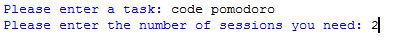

# PyPomodoro
Pomodoro clock to increase working efficiency :trident:

## What is Pomodoro Technique?

The pomodoro technique is a proven and popular time management life hack.
The main premise behind the technique is to work in blocks of time, typically 25 minutes long (called pomodoro sessions), followed by     a 5 minute break. Each pomodoro session should demand your full attention on one task, every break requires you to step away from your     work to rest.
The result is greatly improved productivity during focused work sessions, that can be maintained through effectively managing           distractions and taking regular breaks.

- Source: [Pomodoro](https://www.focusboosterapp.com/the-pomodoro-technique)

## How it works?

Clone the repository, install the requirements and run pomodoro.py.
After running you will get this.

### After 20 minutes

